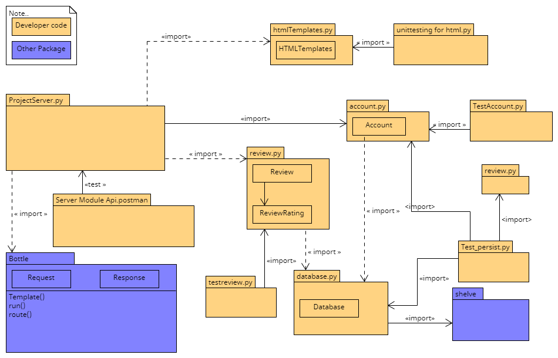

# Interface Architecture Document

The only relationships that are shown in this architectural document are the ones
relevant to the operation of the ProjectServer.py application, and the unit testing 
associated with their respective modules. We kept the following conventions exemplified
in the course notes: a solid line with an arrow indicates that a reference to the 
specified class is stored in a global variable, whereas a dashed line indicates that 
the imported class is only used during a function call. Packages are the named boxes 
with no appended file extensions, and modules/files are named with .py extension and 
in one instance .postman.
	 We did not use an object-oriented model of the bottle framework, thus 
the ProjectServer module has no class interface, and there are module-level functions
in the ProjectServer.py file. The relevant interface components to design 
the ProjectServer module imported from the bottle package are also shown in the diagram. 

### Omitted Relationship(s):
 
There is an import statement in the account module, that imports the review class however,
this is a relic of the first sprint and will most likely be removed in our final sprint. 
Initially, one of the responsibilities of the account module was to store the review objects 
associated with an account, however, we later decided that all review objects would 
simply be stored in the database instead, and thus the functionality of this relic 
was never utilized, consequently this relationship is omitted from the diagram because 
it has no relevance to the operation of the Project server application.

### Interface Architecture

### Sprint Three Changes
At the interface level, all changes were contained to the account module and review module, as well
as their corresponding unit-testing modules. Sprint 3 saw the addition of three new classes, which are
as followed Team (account module), ReviewComment and ReviewSchedule (review module). Specific details of the
role each class plays in the overall scheme of the project server are explained in the Module Architecture Document.
The diagram below illustrates the additional interface changes, and all of the preexisting relationships in the orginal
Interface Architecture document still stands. 
