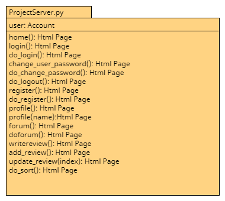

# Module Architecture Document

This document describes the details of the public interface of each module, with
respect to the overall responsibility of each module in the operation of the project
web application. 

##### ProjectServer.py
###### Description:
The file “projectserver.py” acted as the server module for our interpretation of the project. 
The server module was built using the Bottle Framework, and the chosen implementation was 
the “module/function based version” shown in class. The server module was the piece that brought 
together all the other code and put it into an interactive server for the user to use; it imports 
and uses the app logic module, the user logic module and the template module. All methods in this 
module return one of the HTML templates in the templates module. Additional services that were added
in sprint are depicted in the second diagram. 

##### HTMLTemplates.py
###### Description:
The HTMLTemplates module is responsible for rendering html pages for the web application.
The public interface to this module is utilized solely by the ProjectServer.py module. Additional pages that were added
in sprint three are depicted in the second diagram. 

##### Review.py
###### Description:
The review module creates the abstraction of a user being able to post/start
a discussion on a forum that tracks a team's performance on the web application. 
The review abstraction includes a rating mechanism that will allow other user to
rate the performance of a team member using a scale of 1-10. The public interface of
the review abstraction supports creating a new topic discussion, and editing a previous
discussion posts. Sprint three saw the addition of two new classes to this module. Review Comment
allow users to comment under a performance review post, and ReviewSchedule allows users
to schedule the date on which a user's performance review will occur. These additional classes
are depicted below.

##### Account.py
###### Description:
The account module creates the abstraction of a "user" profile on the web application. It
is solely used in the ProjectServer.py module. The public interface of this module primarily
revolves around giving a user access to the web application, for instance registering a new user
creates an account instance, log_in loads an account obj, log out, saves all changes from a session,
a user can also change their password. The ProjectServer.py module utilizes the accounts public interface
to implement these features for the web application. The Account class was extended
by listed methods in the second diagram. Additionally, Sprint 3 saw the addition of a new
Team class. This class was used to model the abstraction of a group of users working together on
the same team. The components of the Team class are illustrated in second diagram.

##### Database.py 
###### Description:
The database module facilitates storage capabilities. The database class stores account object and
review object, as well as the details needed by these abstraction to function correctly. The public
interface of the database primarily revolves around save, load and delete operations. There is also
a change key method, however this is a relic from the first sprint, and will be removed in the next
sprint. The Database module was also extended during sprint 3, however these added methods were private
methods, thus they are not illustrated below as they are not a part of the public interface. These private methods
are associated with the new classes which were designed in sprint 3, however class is responsible for loading
and saving the data it needs to operate correctly. Thus, these methods were made private to avoid compromising 
their data.

